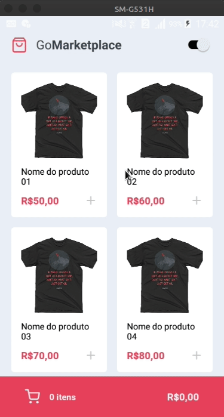

# GoMarketplace 🛍️
Este repositório é referente ao desafio 'Fundamentos do React Native' do Bootcamp GoStack 11.0, da Rocketseat 🚀.

# Proposta
Este projeto é um estudo dos conceitos de Contexto do React-Native, tendo como 'carro chefe' a Context API e seu hook (useContext).
A ideia é simular uma loja fictícia, trazendo dados de uma Fake API e integrar as informações disponíveis em tela, tais como quantidade de produtos e preço final.
O diferencial é o Tema Dark, que também foi construído utilizando a Context API do React.

# Tecnologias Utilizadas
React ⚛️  
React Native ⚛️  
Styled-Components 💅🏻  
Typescript ⌨️

# Utilização
Para obter esse projeto, siga os passos:
1. Clone esse repositório utilizando <code>git clone</code>.
2. Rode o comando <code> yarn </code> na raíz da pasta do projeto clonado para baixar as dependências.
3. Rode o comando <code> yarn android (se estiver emulando em um android) ou yarn ios (se estiver emulando em um ios) </code> na raíz da pasta do projeto clonado para instalar o app no emulador.
4. Rode <code>json-server server.json -p 3333</code> na raíz da pasta do projeto para inicializar a Fake API.
5. Rode <code> yarn start </code> na raíz da pasta do projeto para inicializar o Metro Bundler.
6. Abra o projeto no seu emulador.
7. Happy Hacking! 🚀

⚠️ Caso o projeto não mostre os produtos, rode <code>adb reverse tcp:3333 tcp:3333</code> antes de iniciar a Fake API ⚠️

Resultado:

